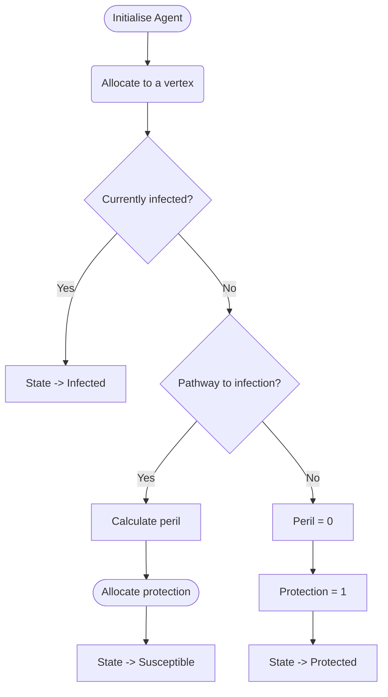
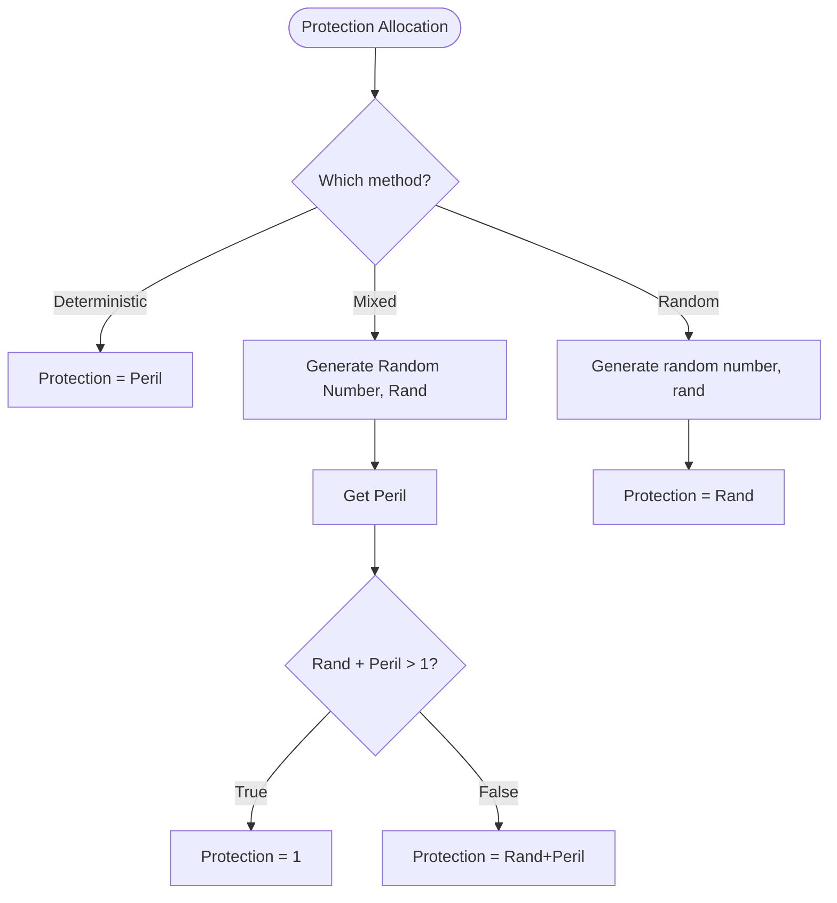
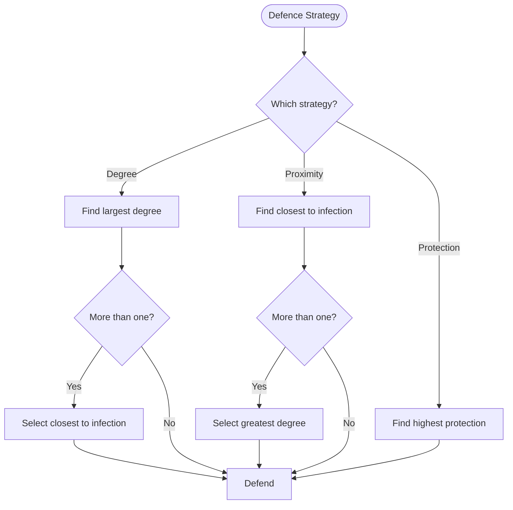

Tags :    #Results #AgencyModel 
Zettel :  20210402-1049
Status : #triage 

-----

# Graphs of Model Results

-----

## Introduction

-----

### Agents

Each agent has four attributes:
* Vertex (location in the graph)
* Peril (function of proximity to infection - the amount of danger they're in)
* Protection (inherent inclination to avoid infection - various allocation methods)
* State (Susceptible, Infected, Recovered, ...)

Initialisation of a new agent follows this process:

-----

### Protection allocation

There are three methods of protection allocation at present:
1. __Deterministic:__ sets the inherent protection rating of each agent equal to their peril rating, which is a function of proximity to the closest infected vertex.
2. __Mixed:__ begins with a baseline (pseudo-)random number for protection, which is then allowed to increase with proximity to closest infection.
3. __Random:__ sets the protection ratings equal to a (pseudo-)randomly generated number.

-----

### Defence strategies

* Defence is the way in which we try to contain the infection in the graph model of disease. 
* In vanilla _Firefighter,_ defence generally entails defending a single vertex each round.
*  In our agency-based stochastic formulation of _Firefighter,_ we are given a quota of defence available that we can distribute according to some particular strategy. 
 
We have three currently available defence strategies:
1. __Degree:__  finds the vertex or vertices with highest degree and defends them, breaking ties based on proximity to closest infection.
2. __Proximity:__ finds the vertex or vertices in closest proximity to closest infection and defends them, breaking ties based on degree.
3. __Protection:__ finds the vertex or vertices with highest protection rating and defends them, without breaking ties.

-----

### Winning strategy

Note: the 'winners' of each model are decided based on the following criteria (which can result in two or three of the defence strategies 'winning' a particular model) -
- First, choose the defence strategy/strategies that resulted in the _fewest infected vertices._
- If there is more than one such strategy, select the strategy/strategies that achieved this in the _shortest time_ (smallest number of turns).
- If there is more than one such strategy, select the strategy/strategies that achieved this with the _greatest number of protected vertices_ (this becomes more significant when we utilise further states such as 'recovered').

-----

## Model Results: Erdős–Rényi Graphs

For each increment, 10 graphs are generated. For each of these ten graphs, we cycle through each vertex - we let that vertex be the source node, begin infection, perform defence, determine new infections and so on until the infection is contained. 

-----

### Deterministic protection allocation

* In the deterministic case, the proximity and protection strategies are incredibly similar because protection is allocated based entirely on proximity to closest infection.
* This means any defence based on protection is in fact based on proximity. 
* However, there is a key difference between the two strategies:
	*  In proximity-based defence, we break ties based on the _degree_ of vertices,
	*  In defence based on protection, _we do not break ties,_ meaning ties are broken by whoever is lexicographically first. 
*  In some cases, defence based on degree may not do very well as a defence strategy, meaning breaking ties on degree presumably also is not a great choice. 
*  There are also cases where there aren't many ties to break when considering proximity, owing to graph structure and current progression of the contagion.

-----

#### Range: $0.05 \leq p \leq 0.95$ (0.05 increments)

![[Results/20210414 charts/percent_infected/0.05-1.00/scatterplots/Deterministic.jpg]]

![[Results/20210414 charts/percent_infected/0.05-1.00/boxplots/Deterministic.jpg]]

![[Results/20210414 charts/percent_infected/0.05-1.00/violinplots/Deterministic.jpg]]

Here, we see proximity and protection allow far less of the graph to become infected than the degree-based defence strategy. As the graph becomes more dense (vertices accumulate more and more edges), degree starts to perform better but the distribution of results here becomes much larger.

![[Results/20210414 charts/winners/0.05-1.00/Deterministic.jpg]]

From the plot of number of wins for each strategy by graph density, we can see that the protection strategy seems not to perform as well as we would expect from the percentage infection plot. This is because, although proximity and protection defences are effectively the same and so arrive at a similar level of percentage infection in the graph, the proximity defence breaks ties (on degree) and protection does not, which usually means it arrives at this same result in fewer turns (less time). 

The number of wins plot makes it very clear that the proximity defence strategy is the best defence in these models across the range of graph densities and the other two strategies only occasionally do as well as proximity, but usually worse, in containing the infection.

-----

#### Range:  $0.01 \leq p \leq 0.20$ (0.01 increments)

We can now focus in on the range 0 to 0.2, where some interesting results from the defence strategies can be observed.

![[Results/20210414 charts/percent_infected/0.01-0.20/scatterplots/Deterministic.jpg]]

![[Results/20210414 charts/percent_infected/0.01-0.20/boxplots/Deterministic.jpg]]

![[Results/20210414 charts/percent_infected/0.01-0.20/violinplots/Deterministic.jpg]]

Here we see an almost immediate departure of the degree strategy from the proximity and protection strategies (which, again are the same strategy up to tie breaking). Interestingly, the range of results for degree at times can be as large as 80%.

![[Results/20210414 charts/winners/0.01-0.20/Deterministic.jpg]]

The win plot is at once not too surprising and quite illuminating when considered with the previous percent infection graph. We can see that, at very low density graphs, all strategies do very well - this is because the graph is barely connected, so infection pathways are very limited, meaning even random defence should perform fairly well. As the graph grows in density, we see the divergence we saw earlier in the wider range of $p$ values - that is, quickly both degree and protection do at least as well as the proximity defence much less until they do as well almost none of the time.

-----

### Mixed protection allocation

The mixed protection allocation involves assigning each agent a baseline pseudo-random number as their protection rating and allowing this to increase as their proximity to fire increases. This represents some variation in the baseline protective inclinations of individuals and the observed behaviour that, as infection becomes perceivably closer to the individual, their protective inclinations (wearing PPE, avoiding physical contact, etc.) increase.

-----

#### Range: $0.05 \leq p \leq 0.95$ (0.05 increments)

![[Results/20210414 charts/percent_infected/0.05-1.00/scatterplots/Mixed.jpg]]

![[Results/20210414 charts/percent_infected/0.05-1.00/boxplots/Mixed.jpg]]

![[Results/20210414 charts/percent_infected/0.05-1.00/violinplots/Mixed.jpg]]

Here, we see the protection based defence strategy performing consistently better across graph densities with the exception of some jumping around between $p=0$ and $p=0.2$, which we focus in on again below.

![[Results/20210414 charts/winners/0.05-1.00/Mixed.jpg]]

Not only does the protection strategy outperform the other two strategies very consistently in reducing percentage infection in models, we can see the strategy also fits the winning criteria in the same range much better than the proximity and degree based strategies.

-----

#### Range:  $0.01 \leq p \leq 0.20$ (0.01 increments)

In the above charts for mixed protection with $p$ values ranging from 0.05 to 1.0, we see the protection-based strategy perform outstandingly well except in the range 0 to 0.2. Here, we again focus on this range and make sense of this behaviour.

![[Results/20210414 charts/percent_infected/0.01-0.20/scatterplots/Mixed.jpg]]

![[Results/20210414 charts/percent_infected/0.01-0.20/boxplots/Mixed.jpg]]

![[Results/20210414 charts/percent_infected/0.01-0.20/violinplots/Mixed.jpg]]

Winning strategies:

![[Results/20210414 charts/winners/0.01-0.20/Mixed.jpg]]

Examining the winning strategies for this range, we see that all three start off fairly well when the graph is very sparse. This makes sense, as no matter where the infection begins, there are incredibly few pathways of infection so any strategy can take credit for not having to do much to contain the outbreak. As $p$ increases, we see all strategies take some wins and more of the graph starts burning - interestingly, proximity does better than both degree and protection based strategies until around $p=0.08$, where we see the uptick in the protection-bases strategy from $p=0.06$ increase to the point protection overtakes the wins that proximity has as the latter continues to decline. Of course, below $p=0.1$, these results should be taken with a pinch of salt - these models have run on graphs with up to 10% density - they are very sparse, so there is not a great deal for the strategies to do before the infection quickly becomes contained because it began in a component of the graph disconnected from other components.

-----

### Random protection allocation

Random protection allocation involves each agent being assigned an entirely (pseudo-)random number to represent their intrinsic inclination towards defence against the contagion propagating through the graph.

-----

#### Range : $0.05 \leq p \leq 0.95$ (0.05 increments)

![[Results/20210414 charts/percent_infected/0.05-1.00/scatterplots/Random.jpg]]

![[Results/20210414 charts/percent_infected/0.05-1.00/boxplots/Random.jpg]]

![[Results/20210414 charts/percent_infected/0.05-1.00/violinplots/Random.jpg]]

We see here, as is becoming common, an initial 'free-for-all' where all three strategies seem to perform fairly inconsistently. Then, as the graph acquires more edges and becomes better connected, the protection-based defence strategy succeeds in protection more of the graph consistently, with the degree and proximity based defence strategies performing roughly as bad as each other.

![[Results/20210414 charts/winners/0.05-1.00/Random.jpg]]

-----

#### Range: $0.01 \leq p \leq 0.20$ (0.01 increments)

![[Results/20210414 charts/percent_infected/0.01-0.20/scatterplots/Random.jpg]]

![[Results/20210414 charts/percent_infected/0.01-0.20/boxplots/Random.jpg]]

![[Results/20210414 charts/percent_infected/0.01-0.20/violinplots/Random.jpg]]

Winning strategies:

![[Results/20210414 charts/winners/0.01-0.20/Random.jpg]]

-----
