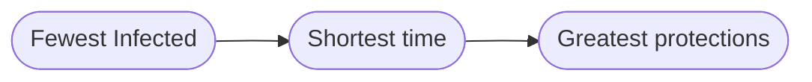

Tags :    #Results #AgencyModel 
Zettel :  20210402-1049
Status : #triage 

-----

# How our Agency-Based Models Work

-----

## Agents

Each agent has four attributes:
* Vertex (location in the graph)
* Peril (function of proximity to infection - the amount of danger they're in)
* Protection (inherent inclination to avoid infection - various allocation methods)
* State (Susceptible, Infected, Recovered, ...)

Initialisation of a new agent follows this process:

-----

## Protection allocation

There are three methods of protection allocation at present:
1. __Deterministic:__ sets the inherent protection rating of each agent equal to their peril rating, which is a function of proximity to the closest infected vertex.
2. __Mixed:__ begins with a baseline (pseudo-)random number for protection, which is then allowed to increase with proximity to closest infection.
3. __Random:__ sets the protection ratings equal to a (pseudo-)randomly generated number.

-----

## Defence strategies

* Defence is the way in which we try to contain the infection in the graph model of disease. 
* In vanilla _Firefighter,_ defence generally entails defending a single vertex each round.
*  In our agency-based stochastic formulation of _Firefighter,_ we are given a quota of defence available that we can distribute according to some particular strategy. 
 
We have three currently available defence strategies:
1. __Degree:__  finds the vertex or vertices with highest degree and defends them, breaking ties based on proximity to closest infection.
2. __Proximity:__ finds the vertex or vertices in closest proximity to closest infection and defends them, breaking ties based on degree.
3. __Protection:__ finds the vertex or vertices with highest protection rating and defends them, without breaking ties.

-----

## Winning strategy

Note: the 'winners' of each model are decided based on the following criteria (which can result in two or three of the defence strategies 'winning' a particular model) -
- First, choose the defence strategy/strategies that resulted in the _fewest infected vertices._
- If there is more than one such strategy, select the strategy/strategies that achieved this in the _shortest time_ (smallest number of turns).
- If there is more than one such strategy, select the strategy/strategies that achieved this with the _greatest number of protected vertices_ (this becomes more significant when we utilise further states such as 'recovered').

-----